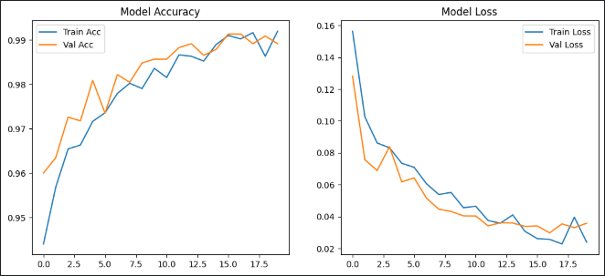

# Epileptic Seizure Detection using CNN + BiLSTM

---

##  Overview

This project focuses on detecting epileptic seizures using a hybrid deep learning architecture that combines Convolutional Neural Networks (CNN) with Bidirectional Long Short-Term Memory (BiLSTM) layers. The model is trained on EEG signal data from the publicly available Epileptic Seizure Recognition dataset.

---

##  How It Works

### 1. **Data Preparation**
- EEG signal data with 178 features per instance.
- Dataset is loaded, reshaped, normalized, and split into train and test sets.

### 2. **CNN + BiLSTM Architecture**
- **CNN Layers**: Extract local temporal features from EEG signals.
- **BiLSTM Layer**: Capture bidirectional temporal dependencies.
- **Dense Layers**: Perform final classification into 5 output classes.
- Model Architecture:


- Distribution of Feature Mean and Feature STD:


---

### 3. **Training & Evaluation**
- Optimizer: Adam
- Loss Function: Categorical Crossentropy
- Metrics: Accuracy
- Evaluation is done using test accuracy, confusion matrix, and plots of training history.

---

## 📈 Results

- **Accuracy & Loss Curve**:




- **Box Plot of Accuracy & Loss Curve**:
  


---

- **Confusion Matrix**:


---

- **Model Comparison Report**:


---

---

##  Performance

- Achieved ~99% test accuracy.
- Robust performance across all 5 classes.

---

##  Requirements

- Python 3.7+
- TensorFlow / Keras
- NumPy
- Pandas
- Matplotlib
- Seaborn
- Scikit-learn

You can install all dependencies using:

```bash
pip install -r requirements.txt
```

---
##  References

- [Epileptic Seizure Recognition Dataset - Kaggle](https://www.kaggle.com/datasets/andrewmvd/epileptic-seizure-recognition)

---

##  Contributions

Feel free to fork the repository and open pull requests to contribute!

---

##  License

Licensed under the MIT License.
